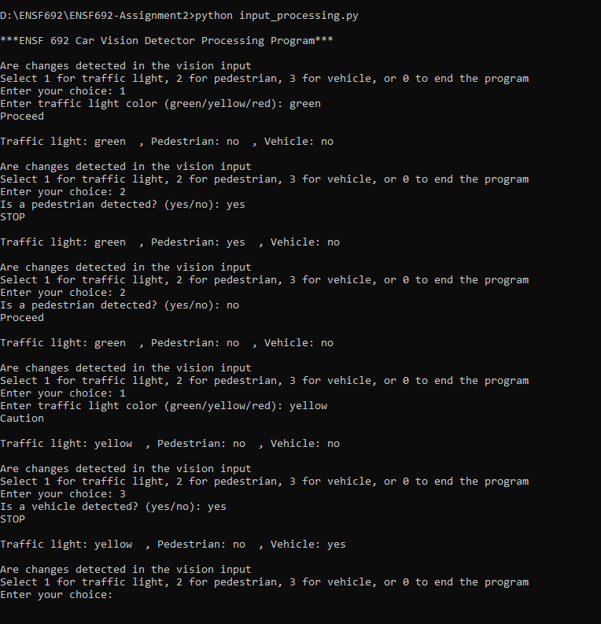
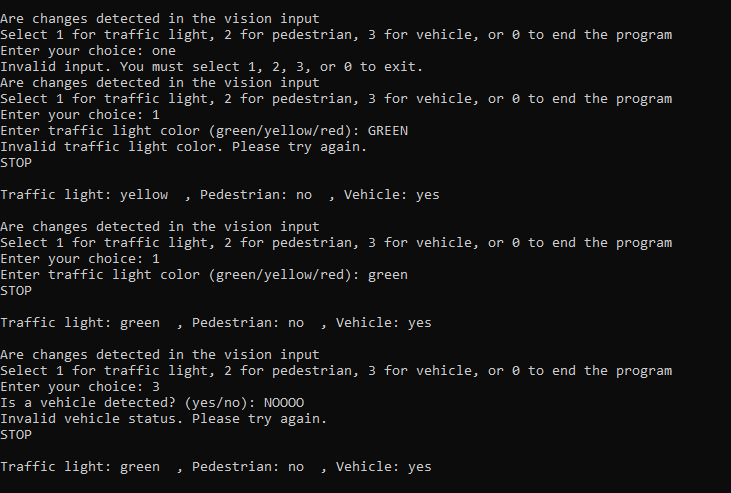
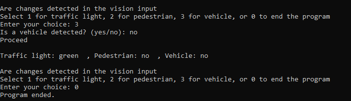

# Car Vision Detector Processing Program
This terminal-based Python application simulates a car's vision detection system, processing inputs from a traffic light, pedestrian sensor, and vehicle sensor to determine an appropriate driving action: STOP, Caution, or Proceed.

# Program Features

The car makes decisions based on these sensor inputs:
- **Traffic Light**: `green`, `yellow`, or `red`
- **Pedestrian**: `yes` or `no`
- **Vehicle**: `yes` or `no`

Traffic Light Detection: Input traffic light color (green, yellow, red).
Pedestrian Detection: Input whether a pedestrian is detected (yes/no).
Vehicle Detection: Input whether another vehicle is detected (yes/no).
## Driving Action:
STOP if traffic light is red or a pedestrian or vehicle is detected.
Precaution when traffic light is yellow and no pedestrian or vehicle is detected.
Proceed in all other safe conditions.

## Usage 

1. Make sure Python 3.x is installed.
2. Download the file `input_processing.py`.
3. Open a terminal, Navigate to the directory where you saved input_processing.py and run the program:

```bash
python input_processing.py
```
## Menu Options
```bash
***ENSF 692 Car Vision Detector Processing Program***

Are changes detected in the vision input?
Select 1 for traffic light, 2 for pedestrian, 3 for vehicle, or 0 to end the program
```

All text inputs must exactly match the expected values:

- Traffic Light: green, yellow, or red

- Pedestrian/Vehicle: yes or no

If an invalid menu option (not 0–3) is entered, the program will prompt again without crashing.

## Sample Output


